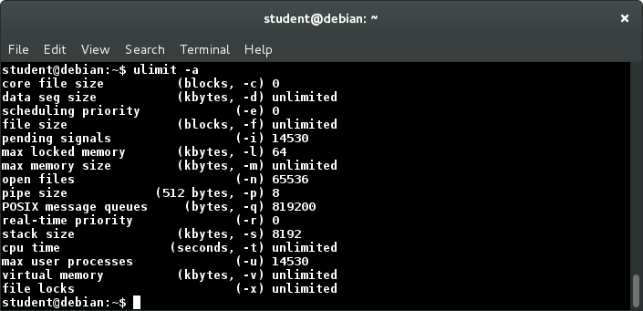
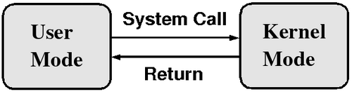
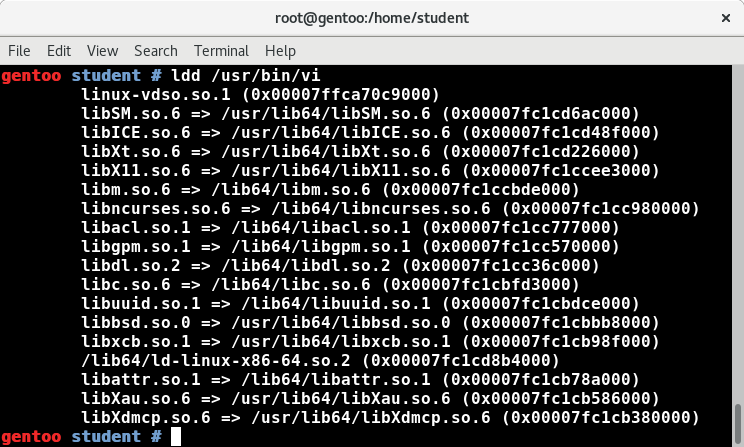

[Previous Chapter](../Ch02-filesystemtreelayout/notes_Ch02.md) - [Table of Contents](../README.md#table-of-contents) - [Next Chapter](../Ch04-signals/notes_Ch04.md)

---

# Chapter 3 Processes - Notes

## 3.3 Learning Objectives:
- Describe a process and the resources associated with it.
- Describe the role of the **init** process.
- Distinguish between processes, programs, and threads.
- Understand process attributes, permissions, and states, and know how to control limits.
- Explain the difference between running in user and kernel modes.
- Describe the **daemon** processes.
- Understand how new processes are forked (created).
- Use **nice** and **renice** to set and modify priorities.
- Understand how shared and static libraries are used.


## 3.4 Processes, Programs, and Threads
**Process**: executing program and associated resources, including environment, open files, signal handlers, etc. Same program may be executing more than once simultaneously -> responsible for multiple processes.

Two or more tasks (threads of execution) can share various resources (eg. entire memory spaces or particular memory areas, open files, etc.). When **everything shared** circumstance -> **multi-threaded** process.

Other OS -> distinction between full **heavy weight** and **light weight** processes. Heavy weight process may include number of light weight processes, or just one.

Linux -> different situation. Each thread of execution considered individually, difference between heavy and light -> sharing of resources, somewhat faster context switching between threads of execution.

Linux -> fast job of creating, destroying, switching between processes (unlike other OS) -> model adopted for multi-threaded application resembles multiple processes: each thread scheduled individually and normally (like stand-alone process). Done instead of involving more levels of complication (eg. having separate method of scheduling along threads of process, having scheduling method between different processes).

Linux -> also respects POSIX and other standards for multi-threaded processes, eg. each thread returns same process ID (called thread group ID internally) while returning distinct thread ID (called process ID internally). May lead to confusion for developers, invisible to administrators.


## 3.5 The init Process
First user process on system -> **init**, has **`process ID` = 1**. Started as soon as kernel initialized + root filesystem mounted.

Runs until system shut down -> last user process to be terminated. Serves as ancestral parent of all other user processes, both directly/indirectly.


## 3.6 Processes
Process -> instance of program in execution. Number of different states (eg. running, sleeping). Every process has **pid** (Process ID), **ppid** (Parent Process ID), **pgid** (Process Group ID); also has program code, data, variables, file descriptors, environment.

**init**: first user process run on system, becomes ancestor of all subsequent processes running on system (except for those initiated directly from kernel, show up with **[]** around name in **ps** listing).

If parent process dies before child -> **ppid** of child set to 1 (ie. process id adopted by **init**). (Note: in recent Linux systems using systemd, **ppid** set to 2, corresponding to internal kernel thread **kthreadd** that has taken over role of adopter of orphaned children from **init**).

**zombie** (or defunct) process: child process which terminated (either normally/abnormally) before parent that has not waited for it and examined its exit code. Releases almost all resources and remains only to convey exit status. Checking on adopted children + let terminated process die gracefully -> one function of **init** process -> sometimes known as **zombie killer**, or **child reaper** (yeesh).

Processes controlled by **scheduling** (completely preemptive). Only kernel has right to preempt process, processes cannot do it to each other.

Largest **`PID`** limited to 16-bit number, 32768, for historical reasons. Possible to alter this value by changing `/proc/sys/kernel/pid_max`, since may be inadequate for larger servers. As processes created, will eventually reach **`pid_max`**, and then will start again at **`PID = 300`**.


## 3.7 Process Attributes
Attributes for all processes:
- Program being executed
- Context (state)
- Permissions
- Associated resources

Every process -> executing some program.

**Context** of process: snapshot of itself by trapping state of its CPU registers, where it is executing in program, what is in process' memory, and other information.

Processes scheduled in and out when sharing CPU time with other (or put to sleep while waiting for some condition to be fulfilled, such as user request or data arrival) -> ability to store entire context when swapping out process, and restore upon execution resumption *critical* to kernel's ability to do **context switching**.


## 3.8 Controlling Processes with ulimit
**ulimit**: built-in bash command, displays or sets a number of resource limits associated with processes running under shell.

Screenshot: running **ulimit** with `-a` argument.


If run as root, result in `Command not found`, since limits shell-specific.

System administrator may need to change some above values in either direction to:
- **Restrict** capabilities so user/process cannot exhaust system resources (eg. memory, cpu time, max number of processes on system)
- **Expand** capabilities so process does not run into resource limits, eg. server handling many clients -> default of 1024 open files, impossible to perform work

Two kinds of limits:
- **Hard**: max value that user can raise resource limit to. Set only by root user
- **Soft**: current limiting value. Can be modified by user, but cannot exceed hard limit

Can set any particular limit by:
```shell
$ ulimit [options] [limit]
```
as in
```shell
$ ulimit -n 1600
```
which increases max number of file descriptors to 1600.

Note: changes only affect current shell. TO make changes effective for all logged-in users, need to modify `/etc/security/limits.conf` (nicely self-documented file), and reboot.


## 3.9 Process Permissions and setuid
Every process -> permissions based on which user invoked + on who owns program file.

Programs with **s** execute bit -> have different **effective user id** than their **real user id** (explained later in local security section). Referred to as **setuid** programs. Run with user id of user who **owns** program. Non-**setuid** pgroams run with permissions of user who **runs** them.

**setuid** programs owned by root -> well-known security problem.

**passwd** program -> example of setuid program. Any user can run. When user executes program, process must run with root permission to update write-restricted `/etc/passwd` and `/etc/shadow` files where user passwords maintained.


## 3.10 More on Process States
Processes can be in on of several possible states. Main ones:
- **Running**: process currently executing on CPU/CPU core, or sitting in **run queue** waiting new time slice. Will resume when scheduler decides deserving to occupy CPU, or when another CPU idle and scheduler migrates process to idle CPU.
- **Sleeping** (ie, **Waiting**): waiting on request (usually I/O) that it has made + cannot proceed until request completed. When request completed, kernel will wake up process, put back on run queue, given time slice on CPU when scheduler decides to do so.
- **Stopped**: suspended process. Commonly experienced when programmer wants to examine executing program's memory, CPU registers, flags, other attributes. One examination done, process may be resumed. Generally done when process run under debugger or user hits **`Ctrl-Z`**.
- **Zombie**: states when process terminates, and no other process (usually parent) inquires about its exit state (ie, reaped it). ALso called **defunct** process. Has released all its resources, except exit state and entry in process table. If parent of any process dies, process **adopted** by **init** (**`PID = 1`**) or **kthreadd** (**`PID = 2`**).


## 3.11 Execution Modes
Process (or any particular thread of multi-threaded process) -> may be executing in **user mode** or **system mode** (usually called **kernel mode** by kernel developers) at any given time.

Instructions that can be executed -> depends on mode + enforced at hardware level (not software).

Mode: state of processor (eg. in multi-core/multi-CPU system, each unit can be in own individual state). *Not* state of system.

Intel parlance:
- User mode: **Ring 3**
- System mode: **Ring 0**


## 3.12 User Mode
Processes execute in **user mode** (lesser privileges than in kernel mode), *except* when executing **system call** (described in next section).

When process started -> isolated in own user space to protect from other processes -> promotes security + greater stability. Sometimes called **process resource isolation**.

Each user mode process -> own memory space, where parts may be shared with other processes. Except shared memory segments, user process not able to read/write into/from memory space of any other process.

Even process run by root user or as **setuid** program -> runs in user mode, *except* when jumping into system call. Has only limited ability to access hardware.




## 3.13 Kernel Mode
Kernel (system) mode -> CPU full access to all hardware on system including peripherals, memory, disks etc. If application needs access to these resources, must issue **system call** -> causes **context switch** from user mode to kernel mode. Must follow this procedure when reading/writing files, creating new process etc.

Application code -> never runs in kernel code, only system call itself (which is kernel code). When system call complete, return value produced -> process returns to user mode with inverse context switch.

Other times when system is in kernel mode that have nothing to do with processes -> handling hardware interrupts, running scheduling routines, other management tasks for system.


## 3.14 Daemons
**Daemon** process: background process, sole purpose to provide specific service to users of system:
- Can be quite efficient because only operate when needed
- Many started at boot time
- Names often (but not always) end with **d**
- Examples: **httpd**, **systemd-udevd**
- May respond to external events (**systemd-udevd**) or elapsed time (**crond**)
- Generally have no controlling terminal and no standard input/output devices
- Sometimes provide better security control

When using SysVinit, scripts in `/etc/init.d` directory start various system daemons. These scripts invoke commands as arguments to shell function named **`daemon`**, defined in `/etc/init.d/functions` file.


## 3.15 Creating Processes in a Command Shell
When user executes command in command shell interpreter such as **bash**:
- New process created (forked from user's login shell)
- Wait system call puts parent shell process to sleep
- Command loaded onto child process' space via **exec** system call (other words, code for command replaces **bash** program in child process' memory space)
- Command completes executing, child process dies via exit system call
- Parent shell re-awakened by death of child process, proceeds to issue new shell prompt. Parent shell then waits for next command request from user, at which time cycle repeated

If command issued for **background** processing (by adding ampersand -**`&`**- at end of command line), parent shell skips wait request and free to issue new shell prompt immediately, allowing background process to execute in parallel. Otherwise, for **foreground** requests, shell waits until child process completes or stopped via signal.

Some shell commands (eg. echo, kill) built into shell itself, do not involve loading of program files. For these commands, no **fork** or **exec** issued for execution.


## 3.16 Kernel-Created Processes
Not all processes created, or **forked** from user parents. Linux kernel directly creates two kinds of processes on own initiative:
- **Internal kernel processes**: take care of maintenance work (eg. making sure buffers get flushed out to disk, load on different CPUs balanced evenly, device drivers handle work queued up for them to do, etc.). Often run as long as system running, sleeping except when they have something to do.
- **External user processes**: run in user space like normal applications, but started by kernel. Very few, usually short lived.

Easy to see which processes are of this nature; when you run command such as
```shell
$ ps -elf
```
to list all processes on system while showing parent process IDs, all will have `PPID = 2` referring to **kthreadd**, internal kernel thread whose job is to create such processes, names will be encapsulated in square brackets such as `[ksoftirqd/0]`.


## 3.17 Process Creating and Forking
Average Linux system -> always creating new processes. Often called **forking**; original parent process continues running while new child process starts.

Back when most computers had single processor: usually configured so parent initially pause while child started to run; UNIX expression: "Children come first." However with modern multi-CPU systems, both tend to run simultaneously on different CPUs.

Often, rather than just fork, one follow with **exex**, where parent process terminates and child process inherits process ID of parent. Term **fork and exec** used so often, sometimes though of as one word.

**spawn**: program often used by older UNIX systems, similar in many ways to **fork and exec**, differing in details. Not part of POSIX standard, not normal part of Linux.

To see how new processes may start:

Example 1: Web server that handles many clients
- May launch new process every time new connection is made with client
- May also simply start only new **thread** as part of same process

Linux -> not much difference on technical level between creating full process or just new thread, each mechanism takes about same time and roughly same amount of resources

Example 2: **sshd** daemon
- started when **init** process executes **sshd** init script
- Script responsible for launching **sshd daemon**
- Daemon process listens for **ssh** requests from remote users
- When request received, **sshd** *creates a new copy of itself* to service request
- Each remote user get own copy of **sshd** daemon running to service their remote login
- **sshd** process will start login program to validate remote user
- if authentication successful, login process will fork off shell (eg. **bash**) to interpret user commands, and so on


## 3.18 Using nice to Set Priorities
Process priority -> can be controlled through **nice** and **renice** commands. Since early days of UNIX, idea: *nice* process lowers priority to yield to others. Thus, higher **niceness**, lower priority.

Niceness values range from -20 (highest priority) to +19 (lowest priority). Normal way to run **nice**:
```shell
$ nice -n 5 command [ARGS]
```
which would increase niceness by 5. Equivalent to doing:
```shell
$ nice -5 command [ARGS]
```

If no **nice** value given, default to increase niceness by 10. If no arguments given at all, reports current niceness:
```shell
$ nice
0

$ nice cat &
[1] 24908

$ ps -l
F S UID   PID  PPID C PRI NI ADDR SZ WCHAN  TTY       TIME CMD
0 S 500  4670  4603 0 80   0 - 16618 wait   pts/0 00:00:00 bash
0 S 500 24855  4670 0 80   0 - 16560 wait   pts/0 00:00:00 bash
0 T 500 24908 24855 0 90  10 - 14738 signal pts/0 00:00:00 cat
0 R 500 24909 24855 0 80   0 - 15887 -      pts/0 00:00:00 ps
```

Note: increasing niceness of process does not mean it won't run. May even get all CPU time if nothing else with which to compete.

If large increment/decrement value outside -20 to 19 range supplied, increment value truncated.


## 3.19 Modifying the Nice Value
Default: only superuser can decrease niceness; i.e., increase priority. However, possible to give normal users ability to decrease niceness within predetermined range by editing `/etc/security/limits.conf`.

To change niceness of already running process, easy to use **renice** command:
```shell
$ renice +3 13848
```
which will increase niceness by 3 of the process with **`pid = 13848`**. More than one process can be done at same time and also some other options, so see **man renice**.


## 3.21 Static and Shared Libraries
Programs built using **libraries** of code, developed for multiple purposes and used/reused in many contexts.

Two types of libraries:
- **Static**: code for library functions inserted in program at **compile time**. Does not change thereafter even if library updated
- **Shared**: code for library funcions loaded into program at **run time**. If library changed after, running program runs with new library modifications

Using shared libraries -> more efficient, because then can be used by many applications at once. Memory usage, executable sizes, application load time reduced.

Shared libraries also called **DLL** s (<strong>D</strong>ynamic <strong>L</strong>ink <strong>L</strong>ibraries).


## 3.22 Shared Library Versions
Shared libraries must be carefully versioned. If significant change to library and program not equipped to handle it, serious problems expected. Sometimes known as **DLL Hell**.

Thus, programs can request specific **major** library version rather than latest one on system. Usually program will always use latest **minor** version available.

Some application providers will use static libraries bundled into program to avoid problems. Down side: if improvements or bugs/security hole fixes in libraries, may not make it into applications in timely fashion.

Shared libraries file extension: **.so**. Typical full name: **`libc.so.N`**, where **`N`** is major version number.

Under Linux, shared libraries carefully versioned:
```shell
c7:/usr/lib64>ls -lF libgdbm.so*
lrwxrwxrwx 1 root root 16 Apr 9 2015 libgdbm.so -> libgdbm.so.4.0.0*
lrwxrwxrwx 1 root root 16 Apr 9 2015 libgdbm.so.4 -> libgdbm.so.4.0.0*
-rwxr-xr-x 1 root root 36720 Jan 24 2014 libgdbm.so.4.0.0*
c7:/usr/lib64>
```
so program that just asks for **`libgdbm`** gets `libgdbm.so` and the others for specific major and minor versions.

## 3.23 Finding Shared Libraries
Program which uses shared libraries has to be able to find them at runtime.

**ldd** can be used to ascertain which libraries required by executable. Shows **soname** of library and what files it points to.



**ldconfig** generally run at boot time (but can be run anytime). Uses file `/etc/ld.so.conf` which lists directories searched for shared libraries. Must run **ldconfig** as root and shared libraries should be stored in system directories only when stable and useful.

Besides searching data base built up by **ldconfig**, linker will first search any directories specified in environment variable **`LD_LIBRARY_PATH`** (colon separated list of directories, as in **`PATH`** variable):
```shell
$ LD_LIBRARY_PATH=$HOME/foo/lib
$ foo [args]
```
or
```shell
$ LD_LIBRARY_PATH=$HOME/foo/lib foo [args]
```

##

[Back to top](#)

---

[Previous Chapter](../Ch02-filesystemtreelayout/notes_Ch02.md) - [Table of Contents](../README.md#table-of-contents) - [Next Chapter](../Ch04-signals/notes_Ch04.md)
