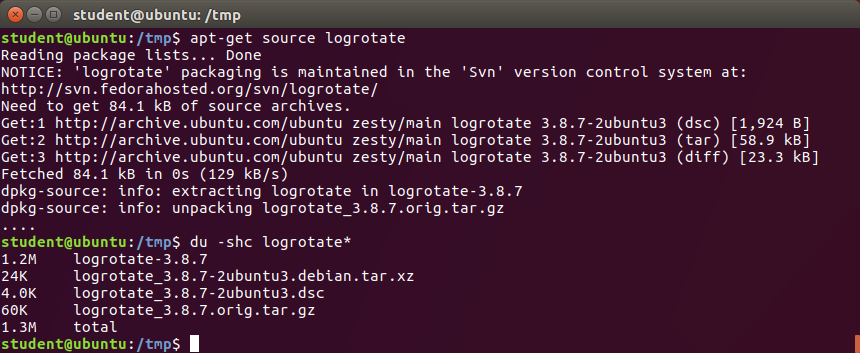

[Previous Chapter](../Ch06-rpm/notes_Ch06.md) - [Table of Contents](../README.md#table-of-contents) - [Next Chapter](../Ch08-yum/notes_Ch08.md)

---

# Chapter 7 DPKG - Notes

## 7.2 Introduction
**Debian Package Manager** (**DPKG**) used by all Debian-based distributions to control installation, verification, upgrade, removal of software on Linux systems. Low-level **dpkg** program can perform all operations, either on just one package, or on list of packages. Operations which cause problems (eg. removing package that another package depends on, installing package when system needs other software to be installed first) blocked from completion.

## 7.3 Learning Objectives:
- Discuss the DPKG packaging system and its uses.
- Explain the naming conventions used for both binary and source **deb** files.
- Know what source packages look like.
- Use querying and verifying operations on packages.
- Install, upgrade, and uninstall Debian packages.


## 7.4 DPKG Essentials
**DPKG** (**Debian Package**): packaging system used to install, remove, manage software packages under Debian Linux and other derived distributions. Like RPM, not designed to directly retrieve packages in day-today use, but to install and remove them locally.

Package files have **`.deb`** suffix and DPKG database resides in `/var/lib/dpkg` directory.

like **rpm**, **dpkg** program has only partial view of universe: knows only what is installed on system, whatever given on command line, knows nothing of other available packages (whether they are in other directory on system or out on Internet). Will also fail if dependency not met, or if trying to remove package other installed packages need.


## 7.5 Package File Names
Debian package file names based on fields that represent specific information. Standard naming format for binary package:

`<name>_<version>-<revision_number>_<architecture>.deb`

as in:

`logrotate_3.8.7-1_amd64.deb`

on Debian, and

`logrotate_3.8.7-1ubuntu1_amd64.deb`

on Ubuntu.

Note: for historical reasons, 64-bit x86 platform called amd64 rather than x86-64, and distributors (eg. Ubuntu) insert their name in package name.


## 7.6 Source Packages
In Debian packaging system, source package consists of at least three files:
1. Upstream tarball, ending with `.tar.gz`. Unmodified source as it comes from package maintainers
2. Description file, ending with `.dsc`, containing package name and other metadata, eg. architecture, dependencies
3. Second tarball containing any patches to upstream source + additional files created for package. Ends with name `.debian.tar.gz` or `.diff.gz` depending on distribution

Eg. on Ubuntu system, can download source package, then see what files downloaded or created:



## 7.7 DPKG Queries
Some examples of queriesL
- List all packages installed:
  ```shell
  $ dpkg -l
  ```
  One can also specify a package name.

- List files installed in `wget` package:
  ```shell
  $ dpkg -L wget
  ```
- Show info about an installed package:
  ```shell
  $ dpkg -s wget
  ```
- Show info about a package file:
  ```shell
  $ dpkg -I webfs_1.21+ds1-8_amd64.deb
  ```
- List files in a package file:
  ```shell
  $ dpkg -c webfs_1.21+ds1-8_amd64.deb
  ```
- Show what package owns `/etc/init/networking.conf`:
  ```shell
  $ dpkg -S /etc/init/networking.conf
  ```
- Show the status of a package:
  ```shell
  $ dpkg -s wget
  ```
- Verify the installed package's integrity:
  ```shell
  $ dpkg -V package
  ```
  Without arguments, this will verify all packages on system. See **man** page to interpret output. Note: only recent versions of **dpkg** (1.17+) support this option.


## 7.8 Installing/Upgrading/Uninstalling Packages
```shell
$ sudo dpkg -i foobar.deb
```
would be used for either installing/upgrading **foobar** package.

If package not currently installed, then will be installed. If package newer than one currently installed, then will be upgraded.

```shell
$ sudo dpkg -r package
```
used to remove all of installed package except for configuration files.

```shell
$ sudo dpkg -P package
```
used to remove all of installed package including configuration files (Note: **`-P`** stands for **purge**).


##

[Back to top](#)

---

[Previous Chapter](../Ch06-rpm/notes_Ch06.md) - [Table of Contents](../README.md#table-of-contents) - [Next Chapter](../Ch08-yum/notes_Ch08.md)
