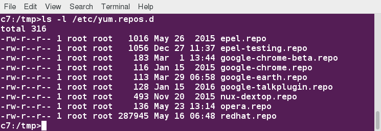

[Previous Chapter](../Ch07-dpkg/notes_Ch07.md) - [Table of Contents](../README.md#table-of-contents) - [Next Chapter](../Ch09-zypper/notes_Ch09.md)

---

# Chapter 8 YUM - Notes

## 8.2 Introduction
**yum** program provides higher level of intelligent services for using underlying **rpm** program. Can automatically resolve dependencies when installing, updating, removing packages. Accesses external software **repositories**, synchronizing with them, retrieving/installing software as needed.

## 8.3 Learning Objectives:
- Discuss package installers and their characteristics.
- Explain how **yum** works as a high level package management system.
- Configure **yum** to use repositories.
- Discuss the queries **yum** can be used for.
- Verify, install, remove, and upgrade packages using **yum**.
- Learn about additional commands and how to install new repositories.
- Understand how to use **dnf**, which has replaced **yum** on Fedora.


## 8.4 Package Installers
Lower-level package utilities (eg. **rpm**, **dpkg**) deal with details of installing specific software package files. managing already installed software.

Higher-level package **management systems** (eg. **yum**, **dnf**, **apt**, **zypper**) work with databases of available software, incorporate tools needed to find, install, update, uninstall software in highly intelligent fashion.
- Can use both local/remote repositories as source to install/update binary as well as source software packages
- Used to automate install, upgrade, removal of software packages
- Resolve dependencies automatically
- Save time because no need to either download packages manually/search out dependency information separately

Software repositories provided by distributions/other independent software providers. Package installers maintain databases of available software derived from catalogs kept by repositories. Unlike low-level package tools, have ability to find/install dependencies automatically -> critical feature.

In this section, discuss **yum** and **dnf**. **zypper** and **apt** discussed in later chapters.


## 8.5 What is yum?
**yum** provides frontend to **rpm**. Primary task: fetch packages from multiple remote repositories, resolve dependencies among packages. Used by majority (but not all) of distributions using **rpm**, including RHEL, CentOS, Scientific Linux, Fedora.

**yum** caches information + databases to speed up performance. To remove some or all cached information, can run command:
```shell
$ yum clean [ packages | metadata | expire-cache | rpmdb | plugins | all ]
```
**yum** has number of modular expressions (plugins) + companion programs that can be found under `/usr/bin/yum*` and `/usr/sbin/yum*`.

Will concentrate on command line use of **yum**, not consider graphical interfaces distributions provide.


## 8.6 Configuring yum to Use Repositories
Repository configuration files kept in `/etc/yum.repos.d`, have **`.repo`** extension. Eg. on one RHEL 7 system:


Note: on RHEL 6 there is no **`redhat.repo`** file. RHEL 6 + earlier versions handled distribution-supplied repos in somewhat different manner, although RHEL clones like CentOS used conventional repos for main distribution packages.


## 8.7 Repository Files
Very simple repository file may look like:
<strong>
```shell
[repo-name]
    name=Description of the repository
    baseurl=http://somesystem.com/path/to/repo
    enabled=1
```
</strong>
More complicated examples found in `/etc/yum.repos.d`, would be good idea to examine them.

Can toggle the use of particular repository on/off by changing value of enabled to 1/0, or using **`--disablerepo=somerepo`** and **`--enablerepo=somerepo`** options when using **yum**.

Can (but should not) also turn off integrity checking with **`gpgcheck`** variable.

## 8.8 Queries
Like **rpm**, **yum** can be used for queries such as searches. However, can search not just what is present on local system, but also inquire about remote repositories. Examples:
- Search for packages with **`keyword`** in name:
  ```shell
  $ sudo yum search keyword
  $ sudo yum list "*keyword*"
  ```
  These two commands give somewhat different information. First one tells more about packages, second one makes it clearer what is installed, what else is available.

- Display information about a package:
  ```shell
  $ sudo yum info package
  ```
  Information includes size, version, what repository it came from, source URL, longer description. Wildcards can be given, eg. **`yum info "libc*"`** for this + most **yum** commands. Note: package need not be installed, unlike queries make with **`rpm -q`**.

More **yum** examples:
- List all packages, or just those installed, available, or updates that have not yet been installed:
  ```shell
  $ sudo yum list [ installed | updates | available ]
  ```

- Show information about package groups installed or available, etc.:
  ```shell
  $ sudo yum grouplist [group1] [group2]
  $ sudo yum groupinfo group1 [group2]
  ```

- Show packages that contain a certain file name:
  ```shell
  $ sudo yum provides
  ```
  as in
  ```shell
  $ sudo yum provides "/logrotate.conf"
  ```
  Note need to use at least one **`/`** in file name, which can be confusing.


## 8.9 Verifying Packages
Package verification requires installation of **yum-plugin-verify** package. Might have to do:
```shell
$ sudo yum install yum-plugin-verify
```
Note: this is **yum plugin**, not executable. Many other plugins available for **yum**, extends possible set of commands and arguments it can take:
- To verify package, giving most information:
  ```shell
  $ sudo yum verify [package]
  ```

- To mimic **`rpm -V`** exactly:
  ```shell
  $ sudo yum verify-rpm [package]
  ```

- To list all differences, including configuration files:
  ```shell
  $ sudo yum verify-all [package]
  ```

Without arguments, above commands will verify all packages installed on system.

By default, verification commands ignore configuration files which may change through normal + safe usage. Some other options: see **man yum-verify**.


## 8.10 Installing/Removing/Upgrading Packages
Some examples of commonly performed operations:
- Install one or more packages from repositories, resolving/installing any necessary dependencies:
  ```shell
  $ sudo yum install package1 [package2]
  ```

- Install from local **rpm**:
  ```shell
  $ sudo yum localinstall package-file
  ```
  This is not quite the same as
  ```shell
  $ rpm -i package-file
  ```
  because it will attempt to resolve dependencies by accessing remote repositories.

- Install specific software **group** from repository, resolving/installing any necessary dependencies for each package in group:
  ```shell
  $ sudo yum groupinstall group-name
  ```
  or
  ```shell
  $ sudo yum install @group-name
  ```

- Remove packages from system:
  ```shell
  $ sudo yum remove package1 [package2]
  ```
  Must be careful with package removal, as **yum** will not only remove requested packages, but all packages that depend on them! May not be what you want, so never run **`yum remove`** with **`-y`** option, which assumes automatic confirmation of removal.

- Update package from repository:
  ```shell
  $ sudo yum update [package]
  ```
  If not package name given, all packages updated.

During installation (or update), if package has configuration file which is updated, will rename old configuration file with **`.rpmsave`** extension. If old configuration file will still work with new software, will name new configuration file with **`.rpmnew`** extension. Can search for these filename extensions (almost always in `/etc` subdirectory tree) to see if you need to do any reconciliation, by doing:
```shell
$ sudo find /etc -name "*.rpm*"
```
Same behavior the more naked underlying **rpm** utility exhibits, but mentioned here for reference.


## 8.11 Additional Commands
No shortage of additional capabilities for **yum**, according to what plugins are installed. Can list them all with:
```shell
$ sudo yum list "yum-plugin"
```
In particular:
- Show list of all enabled repositories:
  ```shell
  $ sudo yum repolist
  ```

- Initiate interactive shell in which to run multiple **`YUM`** commands:
  ```shell
  $ sudo yum shell [text-file]
  ```
  If **`text-file`** given, **yum** will read + execute commands from that file instead of from terminal.

More examples of **yum** commands:
- Download package, but do not install them; just store them under the `/var/cache/yum` directory, or another directory specified:
  ```shell
  $ sudo yum install --downloadonly package
  ```
  or can type **`"d"`** instead of **`"y"`** or **`"n"`** when prompted after issuing install command. Package(s) will be downloaded under `/var/cache/yum` in location depending on repository from which download proceeds, unless **`--downloaddir=`** option used. Any other necessary packages will also be downloaded to satisfy dependencies.

- Can view history of **yum** commands, and, with correct options, even undo/redo previous commands:
  ```shell
  $ sudo yum history
  ```

## 8.12 dnf
**dnf** intended to be next generation replacement for **yum**, will underlie **yum** in RHEL 8.

Can gradually learn to use **dnf** on Fedora systems because it accepts subset of **yum** commands that take care of majority of day-to-day tasks + points out at each use of **yum** that has **dnf** equivalent.

To learn more, see: [Package Management section in the Fedora System Administrator's Guide](https://docs.fedoraproject.org/en-US/Fedora/24/html/System_Administrators_Guide/part-Package_Management.html).


##

[Back to top](#)

---

[Previous Chapter](../Ch07-dpkg/notes_Ch07.md) - [Table of Contents](../README.md#table-of-contents) - [Next Chapter](../Ch09-zypper/notes_Ch09.md)
