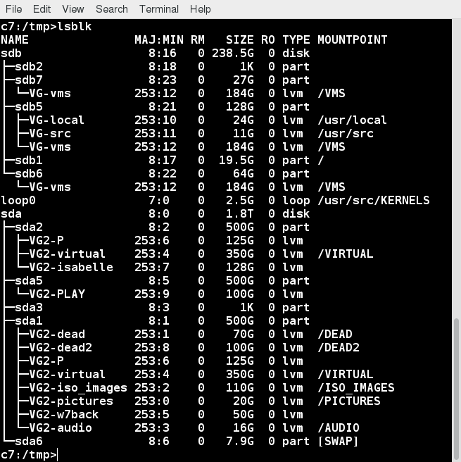

[Previous Chapter](../Ch16-linuxfsvfs/notes_Ch16.md) - [Table of Contents](../README.md#table-of-contents) - [Next Chapter](../Ch18-fsfeatures/notes_Ch18.md)

---

# Chapter 17 Disk Partitioning - Notes

## 17.3 Learning Objectives:
- Describe and contrast the most common types of hard disks and data buses.
- Explain disk geometry and other partitioning concepts.
- Understand how disk devices are named and how to identify their associated device nodes.
- Distinguish among and select different partitioning strategies.
- Use utilities such as **fdisk**, **blkid**, and **lsblk**.
- Back up and restore partition tables.


## 17.4 Common Disk Types
Number of different hard disk types, each characterized by type of **data bus** they are attached to, and other factors such as speed, capacity, how well multiple drives work simultaneously, etc.:
- **SATA** (Serial Advanced Technology Attachment): designed to replace old IDE drives. Offer smaller cable size (7 pins), native hot swapping, faster/more efficient data transfer. Seen as SCSI devices.
- **SCSI** (Small Computer Systems Interface): SCSI disks range from narrow (8 bit bus) to wide (16 bit bus), with transfer rate between 5MB per second (narrow, standard SCSI) and 160MB per second (Ultra-wide SCSI-3). Most PCs use single-ended or differential SCSI drives. Unfortunately, the two types not compatible with each other. Fortunately, the two types of devices may coexist on same controller. Single-ended devices may host up to 7 devices, and use maximum cable length of about 6 meters. Differential controllers may host up to 15 devices, and have maximum cable length of about 12 meters.
- **SAS** (Serial Attached SCSI): use newer point-to-point protocol, have better performance than SATA disks.
- **USB** (Universal Serial Bus): include flash drives and floppies. Seem as SCSI devices.
- **SSD** (Solid State Drives): modern SSD drives have come down in price, have no moving parts, use less power than drives with rotational media, have faster transfer speeds. Internal SSDs installed with same form factor and in same enclosures as conventional drives. SSDs still cost a bit more, but price decreasing. Common to have both SSDs and rotational drives in same machines, with frequently accessed + performance critical data transfers taking place on SSDs.
- **IDE and EIDE** (Integrated Drive Electronics, Enhanced IDE): obsolete.


## 17.5 Disk Geometry
**Disk Geometry**: concept with long history for rotational media. One talks of **heads**, **cylinders**, **tracks**, **sectors**. Below shows how to view geometry with **fdisk**:
```shell
$ sudo fdisk -l /dev/sda
```
Note use of **`-l`** option, which simply lists partition table without entering interactive mode.


Rotational disks composed of one or more platters, each read by one or more **heads**. Heads read circular **track** off platter as disk spins.

Circular tracks divided into data blocks called **sector**, typically 512 bytes in size. **Cylinder**: group which consists of the same track on all platters.

Physical structure image has been less and less relevant as internal electronics on drive actually obscure much of it. SSDs have no moving parts or anything like above ingredients.

Currently, disks starting to be manufactured with sectors larger than 512 bytes; 4KB is becoming available. While larger sector sizes can lead to faster transfer speeds, operating system support not yet mature in dealing with larger sizes.


## 17.6 Partition Organization
Disks divided into **partitions**. In geometrical terms, these consist of physically contiguous groups of sectors or cylinders. Partition: physically contiguous region on disk. Two partitioning layouts in use:
- MBR (Master Boot Record)
- GPT (GUID Partition Table)

MBR dates back to early days of MSDOS. When using MBR, disk may have up to four **primary** partitions. One of the primary partitions can be designated as an extended partition, which can be subdivided further into logical partitions with 15 partitions possible.

When using MBR scheme, if we have a SCSI, eg. `/dev/sda`, then `/dev/sda1`: first primary partition, and `dev/sda2`: second primary partition. If we created an extended partition `dev/sda3`, could be divided into logical partitions. All partitions greater than four -> logical partitions (meaning contained within extended partition). Can only be one extended partition, but it can be divided into numerous logical partitions.

**Note**: Linux doesn't require partitions to begin or end on cylinder boundaries, but other operating systems might complain if they don't. For this reason, widely deployed Linux partitioning utilities try to play nice and end on boundaries. Obviously, partitions should not overlap either.

GPT: on all modern systems, based on UEFI (Unified Extensible Firmware Interface). By default, may have up to 128 primary partitions. When using GPT scheme, no need for extended partitions. Partitions can be up to 2<sup>33</sup> TB in size (with MBR, limit is just 2TB).


## 17.7 Why Partition?
Multiple reasons why it makes sense to divide system data into multiple partitions:
- Separation of user and application data from operating system files
- Sharing between operating systems and/or machines
- Security enhancement by imposing different quotas and permissions for different system parts
- Size concerns; keeping variable and volatile storage isolated from stable
- Performance enhancement of putting most frequently used data on faster storage media
- Swap space can be isolated from data and also used for hibernation storage

Deciding what to partition and how to separate partitions: cause for thought. Reasons to have distinct partitions: increased granularity of security, quote, settings, size restrictions. Could have distinct partitions to allow for data protection.

Common partition layout contains a **boot** partition, a root filesystem `/`, a swap partition, and a partition for `/home` directory tree.

Note: more difficult to resize partition after the fact, than during install/creation time. Plan accordingly.


## 17.8 MBR Partition Table
Disk partition table contained with disk's <strong>M</strong>aster <strong>B</strong>oot <strong>R</strong>ecord (**MBR**), is the 64 bytes following the 446 byte boot record. One partition on a disk may be marked active. When system boots, that partition is where MBR looks for items to load.

Note: can only be one extended partition, but that partition may contain number of logical partitions.

Structure of MBR defined by operating system-independent convention. First 446 bytes: reserved for the program code, typically hold part of a boot loader program. Next 64 bytes: provide space for partition table of up to four entries. Operating system needs this table for handling the hard disk.

On Linux systems, beginning and ending address in CHS ignored.

Note for curious: there are 2 more bytes at the end of the MBR known as the magic number, signature word, or end of sector marker, which always have the value **`0x55AA`**.


**Disk Partition Table**

Each entry in partition table -> 16 bytes long, describes one of the four possible primary partitions. Information for each:
- Active bit
- Beginning address in cylinder/head/sectors (**CHS**) format (ignored by Linux)
- Partition type code, indicating: **xfs**, **LVM**, **ntfs**, **ext4**, **swap**, etc.
- Ending address in CHS (also ignored by Linux)
- Start sector, counting linearly from 0
- Number of sectors in partition

Linux only uses last two fields for addressing, using the linear block addressing (**LBA**) method.


## 17.9 GPT Partition Table
Modern hardware comes with GPT support; MBR support will gradually fade away.

The Protective MBR is for backwards compatibility, so UEFI systems can be booted the old way,

There are two copies of the GPT header, at the beginning + at the end of the disk, describing metadata:
- List of usable blocks on disk
- Number of partitions
- Size of partition entries. Each partition entry has minimum size of 128 bytes


**blkid** utility (to be discussed later) show information about partitions.

On modern UEFI/GPT system:
```shell
ROOT@x7:/root>blkid /dev/sda6
/dev/sda6: LABEL="CENTOS7" UUID="77461ee7-c34a-4c5f-b0bc-29f4feecc743" TYPE="ext4" PARTUUID="1f361af4-81e6-4a81-82"
ROOT@x7:/root>
```
On legacy MBR system:
```shell
c7:/teaching/LFCW/LFS301>sudo blkid /dev/sdb1
/dev/sdb1: LABEL="RHEL7" UUID="471dfeba-3ec7-4529-8069-2afe50762c57" TYPE="ext4"
```

Note: both examples give unique **`UUID`**, which describes filesystem on partition, not the partition itself. Changes if filesystem reformatted.

GPT partition also gives **`PARTUUID`** which describes partition and stays the same even if filesystem reformatted. If hardware supports it, possible to migrate MBR system to GPT, but not hard to *brick* machine while doing so.

Thus, usually benefits not worth the risk.

## 17.10 Naming Disk Devices and Nodes
Linux kernel interacts at low level with disks through device nodes normally found in `/dev` directory. Normally, device nodes accessed only through infrastructure or kernel's Virtual File System. Raw access through device nodes -> extremely efficient way to destroy filesystem. For example, you do this when formatting a partition:
```shell
$ sudo mkfs.ext4 /dev/sda9
```

Device nodes for SCSI and SATA disks follow simple **`xxy[z]`** naming convention, where **`xx`** is device type (usually **`sd`**), **`y`** is the letter for drive number (**`a`**, **`b`**, **`c`**, etc.), and **`z`** is partition number:
- First hard disk is `/dev/sda`
- Second hard disk is `/dev/sdb`
- Etc.

Partitions also enumerated:
- `/dev/sdb1`: first partition on second disk
- `/dev/sdc4`: fourth partition on third disk

In above, **`sd`** means SCSI or SATA disk. Back when IDE disks could be found, they would have been `/dev/hda3`, `/dev/hdb` etc.

Doing **`ls -l /dev`** will show current available disk device nodes.


## 17.11 More on SCSI Device Names
For SCSI devices, need to elaborate a little more on what first, second hard disk etc. means. Determined by controller number/ID number combination.

Drive designation (**`a`**, **`b`**, **`c`**, etc.) primarily based on ID number of SCSI device, rather than position on bus itself.

Eg. if two SCSI controllers with target ID number 1 and 3 on controller 0, and target ID number 2 and 5 on controller 1 (with ID 2 as last drive):
- ID 1: `/dev/sda`
- ID 3: `/dev/sdb`
- ID 2 (on controller 1): `/dev/sdc`
- ID 5: `/dev/sdd`


## 17.12 blkid
**blkid**: utility to locate block devices and report on attributes. Works with **libblkid** library. Can take as an argument a particular device of list of devices. Image below shows use of **blkid** with arguments:
```shell
$ sudo blkid /dev/sda*
```

Can determine type of content (eg. filesystem, swap) a block device holds, and also attributes (tokens, **`NAME=value`** pairs) from content metadata (eg. **`LABEL`** or **`UUID`** fields).

Will only work on devices which contain data that is finger-printable: eg. empty partition will not generate block-identifying **UUID**.

Has two main forms of operations: either searching for a device with specific **`NAME=value`** pair, or displaying **`NAME=value`** pairs for one or more devices. Without arguments, will report on all devices. Quite a few options designating how to specify devices and what attributes to report on. Other sample commands:
```shell
$ sudo blkid
$ sudo blkid -L root
```


## 17.13 lsblk
**lsblk**: related utility which presents block device information in tree format, as shown below:




## 17.14 Sizing Up Partitions
Most Linux systems should use <strong><i>minimum</i></strong> of two partitions:
- **/** (**root**): used for the entire logical filesystem
  - In practice, most installations will have more than one filesystem on more than one partition, which are joined together at **mount points**
  - Difficult with most filesystem types to resize the root partition. Using **LVM** (discussed later), can make this easier.
  - While certainly possible to run Linux with just the root partition, most systems use more partitions to allow for easier backups, more efficient use of disk drives, and better security.
- **Swap**: used as extension of physical memory. Pages of memory which are not file-backed can be moved to disk until needed again.
  - Usual recommendation: swap size should be equal to physical memory in size. Sometimes, twice that recommended. However, correct choice depends on related issues of system use scenarios, hardware capabilities. Examples of thinking on this subject can be found at https://help.ubuntu.com/community/SwapFaq and https://www.suse.com/support/kb/doc/?id=7010157.
  - System may have multiple swap partitions and/or swap files.
  - On a single disk system, try to center the swap partition. On multiple disk systems, try to spread swap over disks.
  - Adding more and more swap will necessarily not help because at a certain point it becomes useless. One will need to either add more memory or re-evaluate system setup.

Swap used as **virtual memory**: any time pages from processes are moved out of physical memory, generally stored on swap device. Recent Ubuntu distributions are now placing swap in a file rather than a partition by default.


## 17.15 Backing Up and Restoring Partition Tables
Partitioning and re-partitioning disks are dangerous operations. Need to know how to back up/restore partition tables in order to restore the situation if something goes wrong.

Backing up can be done easily with **dd**:
```shell
$ sudo dd if=/dev/sda of=mbrbackup bs-512 count=1
```
which will back up **MBR** on first disk, including 64-bit partition table which is part of it.

**MBR** can then be restored, if necessary, by doing:
```shell
$ sudo dd if=mbrbackup of=/dev/sda bs=512 count=1
```

Note: above commands only copy primary partition table. Do not deal with any partition tables stored in other partitions (for extended partitions, etc.).

**Note**: should *always* assume that changing disk partition table might eliminate all data in all filesystems on disk (It should not, but be cautious!). Always prudent to make backup of all data (that is not already backed up) before doing any of this type of work.

In particular, must be careful in using **dd**: simple typing error or misused option could *destroy* entire disk. Hence, do backups!!!

For GPT systems, best to use **sgdisk** tool:
```shell
x7:/tmp>sudo sgdisk --backup=/tmp/sda_backup /dev/sda
The operation has completed successfully.
x7:/tmp>sudo file sda_backup
sda_backup: x86 boot sectorl partition 1: ID=0xee, starthead 0, startsector 1, 1000215215 sectors, extended partition table (last)\011, \
code offset 0x63
```

Note if run on a pure MBR system:
```shell
x7:/tmp>sudo sgdisk --backup=/tmp/sda_backup /dev/sda
*********************************************
Found Invalid GPT and valid MBR; converting MBR to GPT format in memory.
*********************************************
The operation has completed successfully.
x7:/tmp>sudo file sda_backup
/tmp/sda_backup: x86 boot sectorl partition 1: ID=0xee, starthead 0, startsector 1, 3907029167 sectors, code offset 0xb8
```

## 17.16 Partition Table Editors
Number of utilities which can be used to manage partition tables:
- **fdisk**: menu-driven partition table editor. Most standard and one of the most flexible partition table editors. As with any other partition table editor, make sure to write down current partition table settings or make copy of current settings before making changes
- **sfdisk**: non-interactive Linux-based partition editor program, making it useful for scripting. Use **sfdisk** tool with care!
- **parted**: **GNU** partition manipulation program. Can create, remove, resize, move partitions (including certain filesystems). GUI interface to **parted** command is **gparted**
- **gparted**: widely used graphical interface to **parted**
- **gdisk**: used for GPT systems, but can also operate on MBR systems
- **sgdisk**: script or command line interface

Many Linux distributions have live/installation version which can be run off either CD-ROM or USB stick. These media usually include a copy of **gparted**, so can easily be used as graphical partitioning tool on disks which are not actually being used while partitioning program is run.


## 17.16 Using fdisk
**fdisk** always included in any Linux installation, so good idea to learn how to use it. Must be root to run **fdisk**. Can be somewhat complex to handle, caution is advised.

**fdisk** interface: simple and text-driven menu. After starting on particular disk:
```shell
$ sudo fdisk /dev/sdb
```
main (one letter) commands are:
- **`m`**: Display the menu
- **`p`**: List the partition table
- **`n`**: Create a new partition
- **`d`**: Delete a partition
- **`t`**: Change a partition type
- **`w`**: Write the new partition table information and exit
- **`q`**: Quit without making changes

Fortunately, no actual changes are made until you write the partition table to the disk by entering **`w`**. Therefore important to verify partition table is correct (with **`p`**) before writing to disk with **`w`**. If something wrong, can jump out safely with **`q`**.

System will not use new partition table until reboot. However, can use following command:
```shell
$ sudo partprobe -s
```
to try and read in revised partition table. However, this doesn't always work reliably and it is best to reboot before doing things like formatting new partitions, etc. as mixing up partitions can be catastrophic.

Any anytime, can do:
```shell
$ cat /proc/partitions
```
to examine what partitions the operating system is currently aware of.


##

[Back to top](#)

---

[Previous Chapter](../Ch16-linuxfsvfs/notes_Ch16.md) - [Table of Contents](../README.md#table-of-contents) - [Next Chapter](../Ch18-fsfeatures/notes_Ch18.md)
