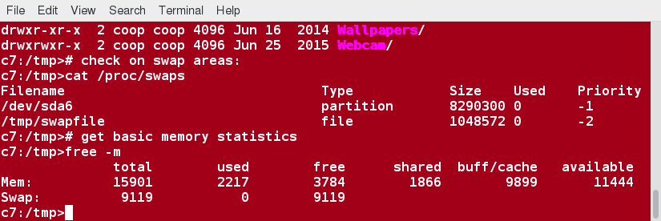
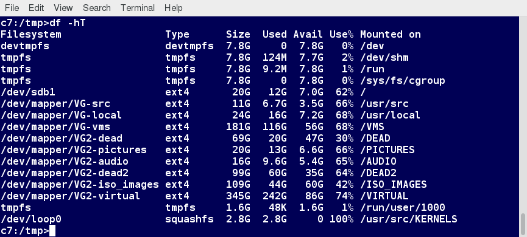
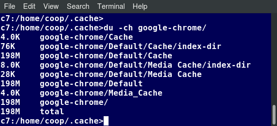

[Previous Chapter](../Ch18-fsfeatures/notes_Ch18.md) - [Table of Contents](../README.md#table-of-contents) - [Next Chapter](../Ch20-extfs/notes_Ch20.md)

---

# Chapter 19 Filesystem Features: Swap, Quotas, Usage - Notes

## 19.2 Introduction
Linux uses tobust **swap space** implementation through which virtual memory system permits apparent use of more memory than is physically available. Filesystem **quotas** can be used to administer user account usage of disk space. Utilities such as **df** and **du** enable easy monitoring of filesystem usage and capabilities.

## 19.3 Learning Objectives:
- Explain the concepts of swap and quotas.
- Use the utilities that help manage quotas: **quotacheck**, **quotaon**, **quotaoff**, **edquota**, and **quota**.
- Use the utilities of **df** and **du**.


## 19.4 Using swap
Linux employs **virtual memory** system, in which operating system can function as if it had more memory than it really does. This kind of memory **overcommission** functions in two ways:
- Many programs do not actually use all the memory they are given permission to use. Sometimes, because child processes inherit copy of parent's memory regions utilizing **COW** (<strong>C</strong>opy <strong>O</strong>n <strong>W</strong>rite) technique, in which child only obtains unique copy (on page-by-page basis) when there is change
- When memory pressure becomes important, active memory regions may be swapped out to disk, to be recalled only when needed again

Such swapping usually done to one or more dedicated partitions or files. Linus permits multiple swap areas, so needs can be adjusted dynamically. Each area has a priority, and lower priority areas are not used until higher priority areas are filled.

In most situations, recommended swap size = total RAM on system. Can see what system currently using for swap areas by looking at `/proc/swaps` and getting basic memory statistics with **free**:
```shell
$ cat /proc/swaps
$ free -m
```



Only commands involving swap:
- **mkswap**: format a swap partition or file
- **swapon**: activate a swap partition or file
- **swapoff**: deactivate a swap partition or file

At any given time, most memory in use for caching file contents to prevent actually going to the disk more than necessary, or in a sub-optimal order or timing. Such pages of memory never swapped out as backing store is file themselves, so writing out a swap would be pointless. Instead, **dirty** pages (memory containing updated file contents that no longer reflect the stored data) flushed out to disk.

Also worth pointing out that in Linux, memory used by kernel itself, as opposed to application memory, *never* **swapped** out, in distinction to some other operating systems.


## 19.5 Filesystem Quotas
Linux can use + enforce quotas on filesystems. Disk quotas allow administrators to control maximum space particular users (or groups) are allowed. Considerable flexibility allowed, and quotas can be assigned on per filesystem basis. Protection provided again subset of users exhausting collective resources.

These utilities help manage quotas:
- **quotacheck**: generates + updates quota accounting files
- **quotaon**: enables quota accounting
- **quotaoff**: disables quota accounting
- **edquota**: used to editing user or group quotas
- **quota**: reports on usage and limits

Quota operations require existence of the files `aquota.user` and `aquota.group` in root directory of filesystem using quotas.

Quotas may be enabled or disabled on per-filesystem basis. In addition, Linux supports use of quotas based on user/group IDs.

Different filesystem types may have additional quota-related utilities, such as **xfs_quota**.


## 19.6 Setting up Quotas
To create filesystem quota, must first make sure to have mounted filesystem with the user and/or group quota mount options. Without these, nothing else will work. Basic steps:
- Mount filesystem with user and/or group quota options:
  - Add **`usrquota`** and/or **`grpquota`** options to filesystems entry in `/etc/fstab`
  - Remount filesystem (or mount it if new)
- Run **quotacheck** on filesystem to set up quotas
- Enable quotas on filesystem
- Set quotas with **edquota** program

First, need to put the right options in `/etc/fstab`:
```shell
/dev/sda5 /home ext4 defaults,usrquota 1 2
```
where we have assumed `/home` is on a dedicated partition.

Then, test with following commands:
```shell
$ sudo mount -o remount /home
$ sudo quotacheck -vu /home
$ sudo quotaon -vu /home
$ sudo edquota someusername
```

May also want to set up **grace periods** with **edquota**. Mount options that should be used in `/etc/fstab` file are **`usrquota`** for user quotas and **`grpquota`** for group quotas.


## 19.7 quotacheck
**quotacheck** utility creates + updates quota accounting files (**`aquota.user`** and **`aquota.group`**) for filesystem.

To update user files for all filesystems in `/etc/fstab` with user quota options:
```shell
$ sudo quotacheck -ua
```
To update group files for all filesystems in `/etc/fstab` with group quota options:
```shell
$ sudo quotacheck -ga
```
To update user file for particular filesystem:
```shell
$ sudo quotacheck -u [somefilesystem]
```
To update group file for particular filesystem:
```shell
$ sudo quotacheck -g [somefilesystem]
```
Use the **`-v`** to get more verbose output.

**quotacheck** generally only run when quotas initially turned on (or need to be updated). Program may also be run when **fsck** reports errors in filesystem when system is starting up.


## 19.8 Turning Quotas On and Off
**quotaon** used to turn filesystem quotas on. **quotasoff** used to turn them off. Used as in:
```shell
$ sudo quotaon  [flags] [filesystem]
$ sudo quotaoff [flags] [filesystem]
```
where flags can be:
```shell
-a, --all                turn quotas off for all filesystems
-f, --off                turn quotas off
-u, --user               operate on user quotas
-g, --group              operate on group quotas
-P, --project            operate on project quotas
-p, --print-state        print whether quotas are on or off
-x, --xfs-command=cmd    perform XFS quota command
-F, --format=formatname  operate on specific quota format
-v, --verbose            print more messages
-h, --help               display this help text and exit
-V, --version            display version information and exit
```

Note: **quotaon** and **quotaoff** programs really one and the same, operate accordingly to which name they are called with.

For example:
```shell
$ sudo quotaon -av
/dev/sda6 [/]: group quotas turned on
/dev/sda5 [/home]: user quotas turned on

$ sudo quotaoff -av
/dev/sda6 [/]: group quotas turned off
/dev/sda5 [/home]: user quotas turned off

$ sudo quotaon -avu
/dev/sda5 [/home]: user quotas turned on

$ sudo quotaoff -avu
/dev/sda5 [/home]: user quotas turned off

$ sudo quotaon -avg
/dev/sda6 [/]: group quotas turned on

$ sudo quotaoff -avg
/dev/sda6 [/]: group quotas turned off
```

Note: quota operations will fail if files **`aquota.user`** or **`aquota.group`** do not exist.


## 19.9 Examining Quotas
**quota** utility used to generate reports on quotas:
- **`quota`** (or **`quota -u`**) returns current user quota
- **`quota -g`** returns current group quota
- Superuser may look at quotas for any user or group by specifying user or group name

For example:
```shell
$ sudo quota george
Disk quotas for user george (uid 1000):
   Filesystem   blocks quota limit grace files quota limit grace
    /dev/sda5   837572   500  1000        5804     0     0

$ sudo quota gracie
Disk quotas for user gracie (uid 1001):
   Filesystem   blocks quota limit grace files quota limit grace
    /dev/sda5    83757  5000 10000        5804     0     0      
```


## 19.10 Setting Quotas
Typing **edquota** brings up quota editor. For specified user or group, temporary file created with text representation of current disk quotas for that user or group.

Then, editor invoked for that file, and quotas may then be modified. Once you leave editor, temporary file read and binary quota files adopt changes.

Soft and hard limits -> only fields which can be edited in quota. Other fields informational only.

Examples of how to use **edquota**:
- **`edquota -u [username]`** edits limits for **`username`**
- **`edquota -g [groupname]`** edits limits for **`groupname`**
- **`edquota -u -p [userproto] [username]`** copies **`userproto`**'s user quota values to **`username`**
- **`edquota -g -p [groupproto] [groupname]`** copies **`groupproto`**'s group quota values to **`groupname`**
- **`edquota -t`** to set grace periods

Third and fourth commands useful for including in scripts which might be used to create new accounts and set quotas for them.

Quotas for users/groups may be set for disk blocks and/or inodes. In addition, soft/hard limits may be set, as well as grace periods. Soft limits may be exceeded for a grace period. Hard limits may never be exceeded.

Grace period set on per-filesystem basis.
```shell
$ sudo edquota gracie
$ sudo edquota -t
```

## 19.11 df: Filesystem Usage
**df** (<strong>d</strong>isk <strong>f</strong>ree) utility examines filesystem capacity and usage. Below, **`-h`** option means "human-readable" (ie. in KB, MD, GB, not bytes) and **`-T`** shows filesystem type. Using **`-i`** option would show inode information instead of bytes.




## 19.12 du: Disk Usage
**du** (<strong>d</strong>isk <strong>u</strong>sage) used to evaluate both disk capacity and usage.

To display disk usage for current directory:
```shell
$ du
```
To list all files, not just directories:
```shell
$ du -a
```
To list in human-readable format:
```shell
$ du -h
```
To display disk usage for specific directory:
```shell
$ du -h somedir
```




##

[Back to top](#)

---

[Previous Chapter](../Ch18-fsfeatures/notes_Ch18.md) - [Table of Contents](../README.md#table-of-contents) - [Next Chapter](../Ch20-extfs/notes_Ch20.md)
