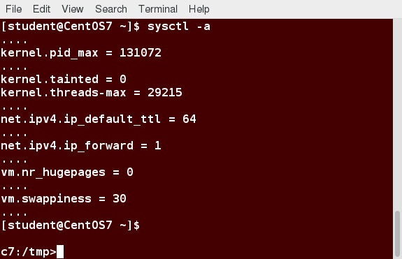

[Previous Chapter](../Ch24-raid/notes_Ch24.md) - [Table of Contents](../README.md#table-of-contents) - [Next Chapter](../Ch26-kernelmodules/notes_Ch26.md)

---

# Chapter 25 Kernel Services and Configuration - Notes

## 25.3 Learning Objectives:
- Grasp the main responsibilities the kernel must fulfill and how it achieves them.
- Explain what parameters can be set on the kernel command line and how to make them effective either for just one system boot, or persistently.
- Know where to find detailed documentation on these parameters.
- Use **sysctl** to set kernel parameters either after the system starts, or persistently across system reboots.


## 25.4 Kernel and Operating System
Narrowly defined, Linux is *only* the **kernel** of the **operating system**, which includes many other components, eg. libraries and applications that interact with the kernel.

Kernel: essential central component that connects hardware to software, and manages system resources eg. memory, CPU time allocation among competing applications/services. Handles all connected devices using **device drivers**, makes devices available for operating system use.

System running ***only*** a kernel has rather limited functionality. Will be found only in dedicated and focused **embedded devices**.


## 25.5 Main Kernel Tasks
Main responsibilities of kernel:
- System initialization and boot up
- Process scheduling
- Memory Management
- Controlling access to hardware
- I/O (Input/Output) between applications and storage devices
- Implementation of local and network filesystems
- Security control, both locally (such as filesystem permissions) and over the network
- Networking control


## 25.6 Kernel Command Line
Various parameters passed to system at boot on **kernel command line**. Normally, these on **`kernel`** (or **`linux16`**) line in GRUB configuration file, but can be modified at boot.

Sample kernel command line will depend on distribution, might look like:
```shell
linux  /boot/vmlinuz-4.19.0 root=UUID=7ef4747-afae-48e3-90b4-9be8be8d0258 ro quiet \
    crashkernel=384M-:128M
```
or, with more minimal set of options:
```shell
linux16 /boot/vmlinuz-4.19.4 root=LABEL=RHEL7 LANG=en_US.UTF-8 ro rhgb quiet
```
and would be found in `/boot/grub2/grub.cfg`.

Everything after **`vmlinuz`** file specified is an option. Any options not understood by kernel will be passed to **init** (**`pid = 1`**), the first user process to be run on system.

Should *not* edit this file directly, but modify the relevant files under `/etc`.

In examples provided above, long lines broken up for display, but they are each all one long line. To see what command line a system was booted with, type:
```shell
$ cat /proc/cmdline
BOOT_IMAGE=/boot/vmlinuz-4.9.0-8-amd64 root=UUID=7ef4e747-afae-48e3-90b4-9be8be8d0258 ro quiet \
    crashkernel=384M-:128M
```

## 25.7 Kernel Boot Parameters
Rather surprisingly long list of available kernel parameters. Detailed documentation can be found:
- In kernel source in file `Documentation/kernel-parameters.txt`
- Online, using [kernel's command line parameters](https://www.kernel.org/doc/html/latest/admin-guide/kernel-parameters.html) documentation
- On system in kernel documentation package provided by most distributions with name like **kernel-doc** or **linux-doc**
- By typing **man bootparam**

Parameters can be specified simply as a value given as an argument, or in the form **`param=value`**, where given value can be a string, integer, array of integers, etc., as explained in documentation file.
```shell
vmlinuz root=/dev/sda6 ..... noapic .... crashkernel=256M
```
Kernel options placed at end of kernel line, separated by spaces. Example of kernel boot parameter (all in one line):
```shell
linux16 /boot/vmlinuz-3.19.1.0 root=UUID=178d0092-4154-4688-af24-cda272265e08 ro \
        vconsole.keymap=us crashkernel=auto vconsole.font=latarcyrheb-sun16 rhgb quiet LANG=en_US.UTF-8
```

Below, can see explanation of some of the boot parameters, some of which were displayed previously:
- **`root`**: root filesystem
- **`ro`**: mounts root device read-only on boot
- **`vconsole.keymap`**: which keyboard to use on the console
- **`crashkernel`**: how much memory to set aside for **kernel crashdumps**
- **`vconsole.font`**: which font to use on the console
- **`rhgb`**: for graphical boot
- **`quiet`**: disables most log messages
- **`LANG`**: system language

By convention, should be no intentionally hidden or secret parameters. Should all be explained in documentation, and patches to kernel source with new parameters should always include patches to documentation file.


## 25.8 sysctl
**sysctl** interface used to read/tune kernel parameters at runtime. Below shows how current values can be displayed by doing:
```shell
$ sysctl -a
```
Each value corresponds to particular pseudofile residing under `/proc/sys`, with directory slashes being replaced by dots. Eg. following two statements equivalent:
```shell
$ sudo sh -c 'echo 1 > /proc/sys/net/ipv4/ip_forward'
$ sudo sysctl net.ipv4.ip_forward=1
```
where second form used to set value with **sysctl** command line interface. Do not leave spaces around **`=`** sign in this command. Note: in first form, cannot just use simple **sudo** with **echo**; command must be done in complicated way shown, or executed as root.



Browsing through pseudofiles under `/proc/sys` will render same information as **`sysctl -a`**. Can get full details on how to use **sysctl** by doing **man 8 sysctl**. To get information about using **`sysctl()`** function from programs to do the same operations, do **man 2 sysctl**.

If settings placed in `/etc/sysctl.conf` (see **man sysctl.conf** for details), settings can be fixed at boot time.

Note: typing:
```shell
$ sudo sysctl -p
```
effectuates immediate digestion of file, settings all parameters as found. Also part of boot process.

On some recent distributions based on **systemd** (such as RHEL 7), actual settings file is now `/usr/lib/sysctl.d/00-system.conf`, but original file still supported, as it is self-documented in that file.


##

[Back to top](#)

---

[Previous Chapter](../Ch24-raid/notes_Ch24.md) - [Table of Contents](../README.md#table-of-contents) - [Next Chapter](../Ch26-kernelmodules/notes_Ch26.md)
