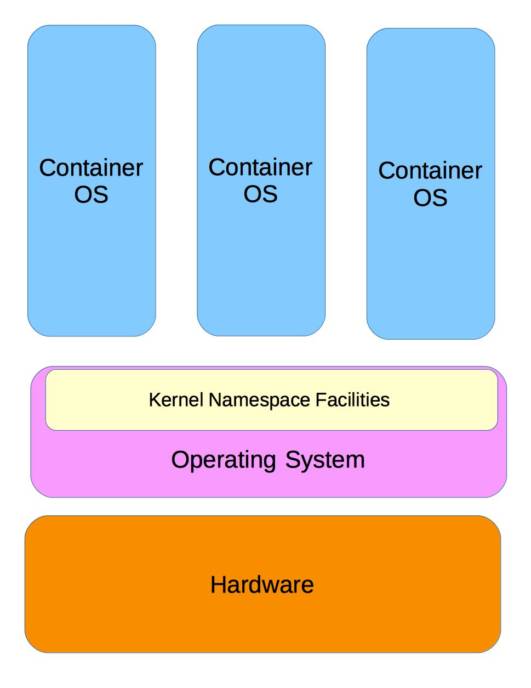

[Previous Chapter](../Ch28-virtualization/notes_Ch28.md) - [Table of Contents](../README.md#table-of-contents) - [Next Chapter](../Ch30-uam/notes_Ch30.md)

---

# Chapter 29 Containers Overview - Notes

## 29.2 Introduction
**Containers** offer light weight method to isolate application/set of applications from other running processes. Unlike virtual machines (each constitutes complete operating system), multiple containers can run simultaneously on one system (either virtualized or physical).

Very common method of deploying containers: using Docker, which will be discussed in some detail.

## 29.3 Learning Objectives:
- Understand the basic parameters and methods that define containers.
- Understand the difference between containers and virtual machines.
- Be familiar with Docker and know the steps necessary to use it properly.
- Use the major commands associated with containers and Docker.


## 29.4 Container Basics
Further integration between hypervisor and Linux kernel allowed creation of operating system-level virtual machines, or containers. Containers share many facilities in Linux kernel, make use of some recent kernel additions such as **namespaces** and **cgroups**. Containers very lightweight, reduce overhead associated with having whole virtual machines.

First flavor of containers: **OS container**. This type of container runs image of operating system with ability to run **init** processes and spawn multiple applications.

One example: LXC (Linux Containers)


**Containers**


## 29.5 Application Virtualization
To further reduce overhead associated with virtual machines, **application virtualization** rising in popularity. Application virtualization runs one application for each container. Many single application containers typically initialized on single machine. Using smaller components creates greater flexibility, reduces overhead normally associated with virtualization.

One such project: Docker


## 29.6 Containers vs. Virtual Machines
Both Virtual Machines and Containers satisfy important needs. Each have use, seen as way to go for almost everything.

Both have long histories:
- Mainframe computers have had software partitioning and virtual machines for decades, in rather specialized ways
- Operating systems have had **chroot** and **BSD Jail** implementations for many years, that share basic isolation motivation with containers

If number of different services and applications need to be tightly integrated, virtual machine functioning as a service may be best solution.

If applications being run were written expecting a complete operating system environment with wide range of services and other libraries/applications, virtual machines may be best.

Virtual machines run complete operating systems, and can run many services and applications. Virtual machines use more resources than containers. Containers usually run one thing. Containers more portable, and can be run inside VM. Containers harder to secure, but usually start faster. Multiple containers ahre one OS kernel, while each VM has its own.

Scaling workloads different for containers and virtual machines. **Orchestration** systems such as Kubernetes or Mesos can decide on proper quantity of containers needed, do load balancing, replicate images, and remove them etc. as needed.

Overall, virtual machines still often the best solution.


## 29.7 Docker
Docker: application-level virtualization using many individual images to build up necessary services to support target application. Images packages into containers - they are components in containers. Images may contain:
- Application code
- Runtime libraries
- System tools
- Or just about anything required for an application

Images may reside on Docker Hub or registry server.

[Docker website](https://www.docker.com/) has documentation, tutorials, and training information.

One of the most compelling features of Docker: an application can be packaged up with all of its dependent code/services, deployed as single unit with minimum of overhead. This deployment can be easily repeated as often as desired. Reduces requirement of building up server with layered services to support end application.


## 29.8 Docker Steps
Starting up a Docker containerized application may include only few steps:
- Install Docker service package with your favorite tool
- Start Docker service
- Search for appropriate image from Docker Hub or private repository
- Pull the image
- Run the image
- Finally, test application

Steps detailed above just a very minimal example of testing a Docker application.

Many options that may be used, including functions that create an image, set system variables or configuration parameters, then store the result as new image. In some cases, writable image required, rather than non-writable one.

Most Docker commands have individual **man** pages. Examples include: **`docker(1)`**, **`docker-search(1)`**, **`docker-pull(1)`**, **`docker-create(1)`**, **`docker-run(1)`**.


## 29.9 docker Command
**docker** command has more than 40 sub-commands, some with 50 or more options. To learn more about **docker** command, can always do:
```shell
$ docker <command> --help
```

Many **docker** sub-commands tend to be somewhat self-documenting. Often confused: **`run`**, **`create`**, and **`exec`**. **`ps`** command will list running containers, or all containers if you include **`-all`** option.

**`docker run`** will start new container and execute a command within. Common options: **`-t`** attached to **tty**, **`-d`** to run the container in the background.

**`docker create`** command creates a container. Has many options for configuring container settings and attachments.

If container already running, and you want to execute something inside of it, can use **`docker exec`** command. Also accepts **`-t`** and **`-d`** options.

**`docker image`** command will show images in various outputs. **`docker rmi`** command will remove images and delete untagged parents by default.

Can also leverage shell functions to operate upon all containers. Eg. to remove all stopped containers, can do:
```shell
$ docker rm $(docker ps -a -q)
```


##

[Back to top](#)

---

[Previous Chapter](../Ch28-virtualization/notes_Ch28.md) - [Table of Contents](../README.md#table-of-contents) - [Next Chapter](../Ch30-uam/notes_Ch30.md)
