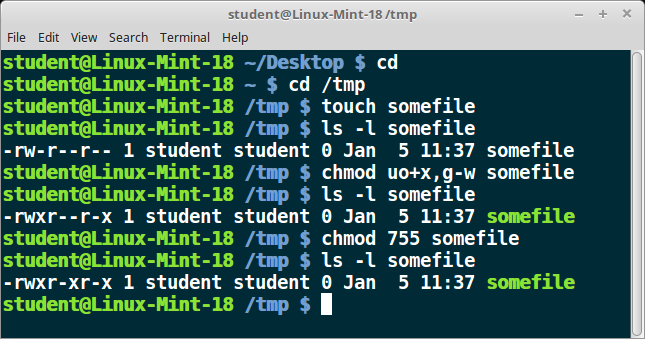

[Previous Chapter](../Ch31-gm/notes_Ch31.md) - [Table of Contents](../README.md#table-of-contents) - [Next Chapter](../Ch33-pam/notes_Ch33.md)

---

# Chapter 32 File Permissions and Ownership - Notes

## 32.3 Learning Objectives:
- Explain the concepts of **owner**, **group**, and **world**.
- Set file access rights (read, write, and execute) for each category.
- **Authenticate** requests for file access, respecting proper permissions.
- Use **chmod** to change file permissions, **chown** to change user ownership, and **chgrp** to change group ownership.
- Understand the role of **umask** in establishing desired permissions on newly created files.
- Use ACLs to extend the simpler user, group, world and read, write, execute model.


## 32.4 Owner, Group, and World
When you do an **`ls -l`** as in:
```shell
$ ls -l a_file
-rw-rw-r-- 1 coop aproject 1601 Mar 9 15:03  a_file
```
after the first character (which indicates the type of the file object), there are nine more which indicate the access rights granted to potential file users. There are arranged in three groups of three:
- **owner**: the user who owns the file (also called **user**)
- **group**: the group of users who have access
- **world**: the rest of the world (also called **other**)

In above listing, user is **`coop`** and group is **`aproject`**.


## 32.5 File Access Rights
If you do a long listing of a file, as in:
```shell
$ ls -l /usr/bin/vi
-rwxr-xr-x. 1 root root 910200 Jan 30 2014 /usr/bin/vi
```
each of the triplets can have each of the following sets:
- **r**: read access is allowed
- **w**: write access is allowed
- **x**: execute access is allowed

If permission not allowed, a **`-`** appears instead of one of these characters.

In addition, other specialized permissions exist for each category, such as the **setuid/setgid** permissions.

This, in preceding example, user **`coop`** and members of the group **`aproject`** have read and write access, while anyone else has only read access.


## 32.6 File Permissions and Security and Authentication
**File access permissions** are critical part of Linux security system. Any request to access file requires comparison of credentials and identity of requesting user to those of the owner of the file.

This **authentication** is granted depending on one of these three sets of permissions, in following order:
1. If the requester is the file owner, the file owner permissions are used
2. Otherwise, is the requester is in the group that owns the files, the group permissions are examined
3. If that doesn't succeed, the world permissions are examined


## 32.7 Changing Permissions: chmod
Changing file permissions is done with **chmod**. You can only change permissions on files you own, unless you are the superuser.

There are a number of different ways to use **chmod**. For instance, to give owner and world execute permission, and remove group write permission:
```shell
$ ls -l a_file
-rw-rw-r-- 1 coop coop 1601 Mar 9 15:04  a_file
$ chmod uo+x,g-w a_file
$ ls -l a_file
-rwxr--r-x 1 coop coop 1601 Mar 9 15:04  a_file
```
where **`u`** stands for user (owner), **`o`** stands for other (world), and **`g`** stands for group.

Permissions can be represented either as a bitmap, usually written in octal, or in a symbolic form. Octal bitmaps usually look like **`0755`**, which symbolic representations look like **`u+rwx,g+rwx,o+rx`**.


## 32.8 Octal Digits
Symbolic syntax can be difficult to type and remember, so one often uses octal shorthand, which lets you set all the permissions in one step. Done with simple algorithm, and a single digit suffices to specify all three permission bits for each entity. Octal number representation if **sum** for each digit of:
- **4** if read permission desired
- **2** if write permission desired
- **1** if execute permission desired

Thus, **7** means read/write/execute, **6** means read/write, **5** means read/execute.

When you apply this with **chmod**, have to give a value for each of the three digits:
```shell
$ chmod 755 a_file
$ ls -l a_file
-rwxr-xr-x 1 coop coop 1602 Mar 9 15:04  a_file
```

Permissions can be represented either as a bitmap, usually written in octal, or in a symbolic form. Octal bitmaps usually look like **`0755`**, which symbolic representations look like **`u+rwx,g+rwx,o+rx`**.




## 32.9 chown and chgrp
Changing file ownership is done with **chown** and changing the group is done with **chgrp**.

Only the superuser can change ownership on files. Likewise, can only change group ownership to groups that you are a member of.

Changing group ownership of file:
```shell
$ chgrp cleavers somefile
```
and changing ownership (only superuser can do this):
```shell
$ chown wally somefile
```
Can change both at same time with:
```shell
$ chown wally:cleavers somefile
```
where you separate owner and group with colon (or period).

All three of these programs take **`-R`** option, which stands for recursive. For example:
```shell
$ chown -R wally:cleavers ./
$ chown -r wally:wally subdir
```
will change owner and group of all files in current directory and all its subdirectories in first command, and in **`subdir`** and all its subdirectories in second command.


## 32.10 umask
Default permissions given when creating file are read/write for owner, group **and** world (**`0666`**), and for a directory it is read/write/execute for everyone (**`0777`**). However, if you do the following:
```shell
$ touch afile
$ mkdir adir
$ ls -l | grep -e afile -e adir
drwxrwxr-x 2 coop coop 4096 Sep 16 11:18 adir
-rw-rw-r-- 1 coop coop    0 Sep 16 11:17 afile
```
you will notice actual permissions have changed to **`664`** for the file and **`775`** for the directory. They have been modified by current **umask** whose purpose is to show which permissions should be denied. The current value can be shown by:
```shell
$ umask
0002
```
which is the most conventional value set by system administrators for users. This value if combined with the file creation permissions to get the actual result; i.e.,
```shell
0666 & ~002 = 0664; i.e., rw-rw-r--
```
Can change **umask** at any time with **umask** command:
```shell
$ umask 0022
```

## 32.12 Filesystem ACLs
Linux contains full implementation of POSIX ACLs (<strong>A</strong>ccess <strong>C</strong>ontrol <strong>L</strong>ists) which extends simpler user, group, world and read, write, execute model.

Particular privileges can be granted to specific users or groups of users when accessing certain objects or classes of objects. Files and directories can be shared without using **`777`** permissions.

While Linux kernel enables use of ACLs, still must be implemented as well in particular filesystem. All major filesystems used in modern Linux distributions incorporate the ACL extensions, and one can use the option **`-acl`** when mounting. Default set of ACLs is created at system install.


## 32.13 Getting and Setting ACLs
To see ACLs:
```shell
$ getfacl file|directory
```
**Example:**
```shell
$ getfacl file1
```
To set ACLs:
```shell
$ setfacl options permissions file|directory
```
**Examples:**
```shell
$ setfacl -m u:isabelle:rx /home/stephane/file1
$ setfacl -x u:isabelle    /home/stephane/file
```
Note: new files inherit default ACL (if set) from the directory they reside in. Also note: **mv** and **cp -p** preserves ACLs.

To remove an ACL:
```shell
$ setfacl -x u:isabelle /home/stephane/file1
```
To set default on directory:
```shell
$ setfacl -m d:u:isabelle:rx somedir
```


##

[Back to top](#)

---

[Previous Chapter](../Ch31-gm/notes_Ch31.md) - [Table of Contents](../README.md#table-of-contents) - [Next Chapter](../Ch33-pam/notes_Ch33.md)
