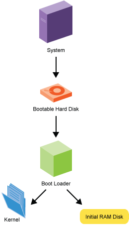
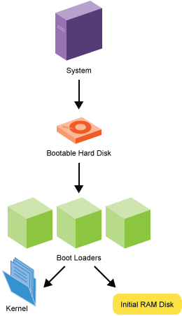
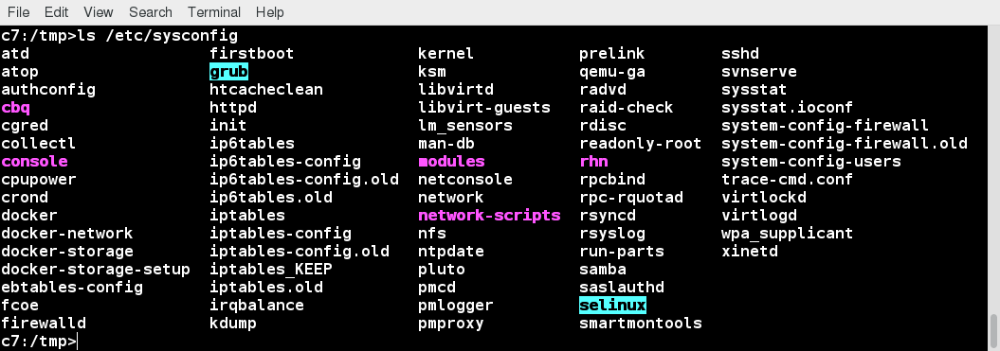
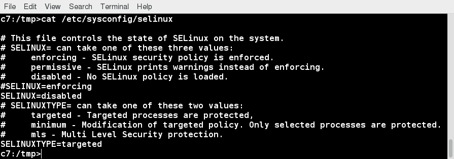
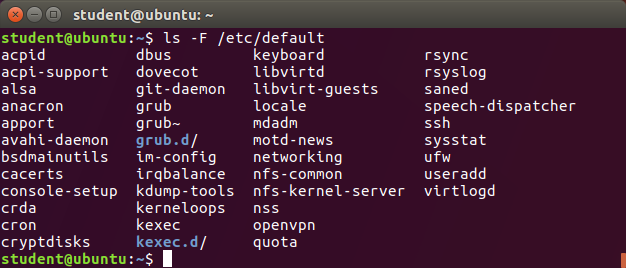
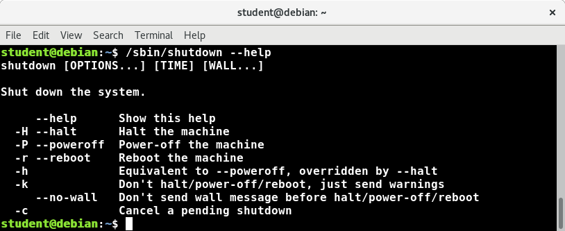

[Previous Chapter](../Ch36-firewalls/notes_Ch36.md) - [Table of Contents](../README.md#table-of-contents) - [Next Chapter](../Ch38-grub/notes_Ch38.md)

---

# Chapter 37 System Startup and Shutdown - Notes

## 37.3 Learning Objectives:
- Explain the boot process.
- Identify several types of boot loaders.
- Describe what the BIOS does.
- Identify the relevant configuration files.
- Describe how the system shuts down and reboots.

## 37.4 Boot Sequence
Basic steps in boot sequence:
1. BIOS/UEFI locates and executes the boot program, or boot loader.
2. Boot loader loads the kernel.
3. Kernel starts the **init** process (`pid=1`).
4. **init** manages system initialization, using systemd or the older Upstart and SysVinit startup scripts.

When power applied to computer, computer can only perform operations the BIOS (<strong>B</strong>asic <strong>I</strong>nput <strong>O</strong>utput <strong>S</strong>ystem) orders it to do.

First, BIOS runs POST (<strong>P</strong>ower <strong>O</strong>n <strong>S</strong>elf <strong>T</strong>est), which checks memory and hardware, then searches specific location or device for boot program. Typically, boot program found in device's MBR (<strong>M</strong>aster <strong>B</strong>oot <strong>R</strong>ecord). Control of computer is then transferred to this boot program (usually GRUB).

Boot program then loads kernel into memory and executes it. On x86 platforms (and many others), kernel first has to decompress itself in place. It then performs hardware checks, gains access to important peripheral hardware, and eventually runs **init** process. This first process continues the system startup, managing either systemd or Upstart, or running appropriate init scripts is SysVinit is being used.

Newer computers are moving to UEFI, a replacement for BIOS, which performs many of the same functions.

 **The Boot Sequence**

## 37.5 BIOS
On x86 architecture, BIOS contains all the code required to gain initial access to the keyboard, display screen, disk drives, serial communications, and a number of miscellaneous functions. Once full system running, most of these devices will have enhanced capabilities when complete and specialized device drivers can be loaded and take over.

BIOS typically placed in ROM chip that comes with computer (often called ROM BIOS). This ensures that BIOS will always be available and will not be damaged by disk failures. This also makes it possible for computer to boot itself.

During boot process, BIOS loads boot loader from MBR.

## 37.6 Boot Loaders
Number of different boot loaders used in Linux:
- **GRUB**
- **efibootmgr**
- **LILO**
- **Das U-Boot**

Virtually, all (non-embedded) modern Linux distributions use **GRUB** (<strong>GR</strong>and <strong>U</strong>nified <strong>B</strong>oot Loader). GRUB's features include ability to boot multiple operating systems, both graphical and text-based interface allowing ease of use over serial cable, powerful command line interface for interactive configuration, network-based diskless booting, and other advanced features.

**efibootmgr** not actually a boot loader, but is a **boot manager**, used in conjunction with **GRUB** on multi-boot EFI systems.

The <strong>Li</strong>nux <strong>Lo</strong>ader (**LILO**) is older and obsolete.

**Das U-Boot** is the most popular loader for embedded Linux systems. Some other boot loaders, including **bareboot**. However, not really considering embedded space in this course.

 **Boot Loaders**

## 37.7 Configuration Files in /etc
Earlier, discussed about where Linux distributions cooperate, and hopefully follow agreed-upon standards to place certain kinds of files in standard places on system.

In particular, system-side configuration files generally placed in `/etc` and its subdirectories, while user-specific ones often placed in their individual home directories. Not completely true, though; eg, default configuration information might be stored in `/usr/lib/systemd`, but can be overridden by files in `/etc/systemd`.

FOr historical reasons, Linux distributions evolved their own rules about exactly where to place some information in `/etc`. Eg., all Red Hat-derived systems make extensive use of `/etc/sysconfig`, while Debian-based systems have used `/etc/default`. Interestingly, RHEL 7 and SUSE use both.

## 37.8 /etc/sysconfig
On RHEL 7 systems, files in `/etc/sysconfig` used when starting, stopping, configuring, or querying system services.
```shell
$ ls /etc/sysconfig
```


Can take a look at one file in screenshot here; this files reads and sets the **selinux** configuration at system startup.
```shell
$ cat /etc/sysconfig/selinux
```


## 37.9 /etc/default
Screenshot shows `/etc/default` directory on Ubuntu 17.04 system.

Use of this directory similar to that of Red Hat's `/etc/sysconfig`:
- Files used to provide extra options when starting a service
- Typically contain code to set environment variables.

Eg., file `/etc/default/useradd` sets defaults that are used when new user accounts are being created. As noted, RHEL 7 also has this directory as its use if becoming more universal.



## 37.10 Shutting Down and Rebooting
**shutdown** used to bring system down in secure fashion, notifying all users that system is going down and then stopping it in a graceful and non-destructive way. After it is shutdown, system if either halted or rebooted. Can see some shutdown examples here:
```shell
$ sudo shutdown -h +1 "Power Failure imminent"
$ sudo shutdown -h now
$ sudo shutdown -r now
$ sudo shutdown now
```
Options can easily be listed by built-in help message.



With no options (eg. `shutdown now`), default behavior is to power off the system completely. Some distributions, such as Ubuntu, violate this and go to single user mode instead.

One common mistake is failing to include a time argument (such as `now` or some actual time). This is required.

There are also lagacy commands **reboot**, **halt**, **poweroff**, which many veteran users use frequently.

##

[Back to top](#)

---

[Previous Chapter](../Ch36-firewalls/notes_Ch36.md) - [Table of Contents](../README.md#table-of-contents) - [Next Chapter](../Ch38-grub/notes_Ch38.md)
