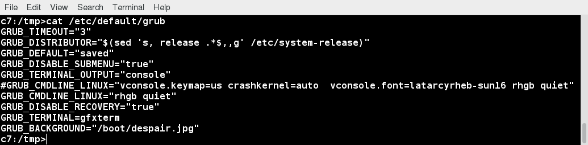
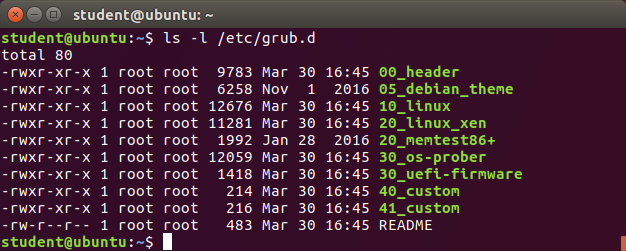

[Previous Chapter](../Ch37-systemsusd/notes_Ch37.md) - [Table of Contents](../README.md#table-of-contents) - [Next Chapter](../Ch39-init/notes_Ch39.md)

---

# Chapter 38 GRUB - Notes

## 38.2 Introduction
A system that can not start up on its own is rather useless. Linux systems have a lot of flexibility in how they boot. Possible to choose between different kernel versions or options, or even different operating systems in multiple-boot scenarios. Most non-embedded systems use the Grand Unified Boot Loader to accomplish the first steps of a successful system initialization. GRUB also has interactive capabilities as well as a secure password facility.

## 38.3 Learning Objectives:
- Explain what the role of GRUB is.
- Understand the differences between the GRUB 1 and GRUB 2 versions.
- Explain the interactive selections you can make at boot.
- Install GRUB.
- Explain how the configuration files that GRUB needs are used and modified.

## 38.4 What is GRUB?
Virtually, all x86-based Linux systems (outside the embedded sphere) today use GRUB (<strong>GR</strong>and <strong>U</strong>nified <strong>B</strong>ootloader) to handle early phases of system startup. Other platforms may have other equivalents, such as ELILO used on EFI systems such as IA64 (Itanium), and Das U-BOOT used on many embedded configurations.

Some important features of GRUB are:
- Alternative operating systems can be chosen at boot time.
- Alternative kernels and/or initial ramdisks can be chose at boot time for a given operating system.
- Boot parameters can be easily changed at boot time without having to edit configuration files, etc. in advance.

GRUB Version 2 has replaced Version 1 on all major Linux distributions, except for RHEL 6-based ones. While the details are different between versions, basic philosophy is the same. Thus, will concentrate almost exclusively on Version 2.

At boot, basic configuration file is read, either `/boot/grub/grub.cfg` or `/boot/grub2/grub.cfg`, depending on distribution.

This file is auto-generated by **update-grub** (or **grub2-mkconfig** on RHEL 7) based on configuration files in the `/etc/grub.d` directory and on `/etc/default/grub` and should never be edited by hand. Usually, these utilities are run from other distribution-supplied scrips used for updating or compiling Linux kernels.

For either version, relevant essential configuration file contains some global parameters and then a stanza for each operating system or kernel configured.

## 38.5 Interactive Selections with GRUB at Boot
Upon system boot, after the initial POST and BIOS stages, GRUB will be entered and will display a menu. This may or may not have graphics in it (at least for the background splash screen).

Menu contains list of bootable images from one or more Linux distributions or operating systems. There may also be submenus with even more choices.

Using up and down arrows and the **Enter** key, can select the right boot option, or can wait for a configurable time period before the default choice is entered.

However, can do much more. After selecting an entry, can type **e** for edit, and then enter into interactive shell. In this shell, can alter the **stanza** in the configuration file that describes the particular boot option. Usually, do this to alter the **kernel command line**; eg., adding the word **single** at the end of the command line will cause system to boot in single user mode in order to take corrective action. Once desired change is made, can hit the right key to make the system boot.

At bottom of screen, will see displayed information on the exact key strokes, so there is no need to memorize.

Note: any changes made to configuration are **not persistent** and will be lost on next boot. So, for permanent change, need to change the actual files on the machine, using the right utilities.

Also possible to enter a pure shell, rather than edit a particular **stanza**. Can run a number of different commands and even try to re-install or repair GRUB. If there are serious problems, like not being able to find a configuration file, GRUB reverts back to this command line mode and you may be able to rescue the system without resorting to rescue media.

## 38.6 Installing GRUB
The word **installing** can have several different meanings with respect to GRUB:
1. Installing the **grub** program and associated utilities in their proper locations. In GRUB 1 there is actually a program called **grub**, but in GRUB 2 there are a bunch of utilities with names like **grub2-*** or **grub-***; how they are packaged is rather distribution dependent.
2. Installing the files GRUB needs to operate at boot time, under either `/boot/grub` or `/boot/grub2`. Separate than the files the Linux kernel needs (**`vmlinuz-*`**, **`initramfs-*`**) which will need to be in `/boot` directory as well.
3. Installing GRUB as the **boot loader** in system; usually, done at the front of the entire hard disk, but can also be done in a partition and accessed via **chainloading** from one GRUB to another.

If you do not install GRUB during a system installation, or need to re-install at some later point, exact procedure for doing so depends on GRUB version. For either version, relevant essential configuration file contains some global parameters, and then, a stanza for each operating system or kernel configured.

For Version 2, installation procedure can be as easy as:
```shell
$ sudo grub2-install /dev/sda
```

Please read **man** page carefully before running such command. Many options, and messing up GRUB can make system un-bootable. In particular, have to tell system where to find `/boot` directory, what partition it resides in.

Note: on EFI multi-boot systems, may have to also run **efibootmgr** as things can be more complex. See **man** page.

## 38.7 GRUB Device Nomenclature
In both GRUB versions, the first hard drive is denoted as **`hd0`**, second is **`hd1`**, etc. However, in Version 1, partitions start counting from 0, and in Version 2 from 1:
- **`sda1`** is **`(hd0,1)`** in **GRUB 2**, but **`(hd0,0)`** in **GRUB 1**.
- **`sdc4`** is **`(hd2,4)`** in **GRUB 2**, but **`(hd2,3)`** in **GRUB 1**.

There is no need to emphasize that getting confused about this can be rather destructive. Both versions of GRUB sometimes use **`sda#`** notation, and sometimes use **`(hd0,#)`**, so can get further confusing.

Within configuration file, each stanza has to specify what the root partition is; not the same as what is meant when talking about root directory of system. In this context, means the partition contains the kernel itself (in the `/boot` directory). Eg., very common to have `/boot` in its own partition, such as `/dev/sda1`.

Also fine to do **`kernel (hd0,0)/vmlinuz....`** instead, and leave out **`root`** line.

Quick look at `grub.cfg` should make it clear.

## 38.8 GRUB Configuration File
Remember: should not edit **`grub.cfg`** directly. Two locations in `/etc` directory that should require attention and are used to reconstruct **`grub.cfg`** whenever system altered with new kernels, or relevant updating program (such as **update-grub** or **grubby**) manually run.

First location: `/etc/default/grub`. Screenshot shows how this looks like on RHEL 7 system. Red Hat has really slimmed down this file compared to other distributions.



Second location: `/etc/grub.d`. Screenshot shows how it looks on Ubuntu 17.04.

Each of the two files (`/etc/default/grub` and `/etc/grub.d`) run in ascending order when configuration file updated. Won't discuss them here, as they are self-documenting and recommend to look at them.




##

[Back to top](#)

---

[Previous Chapter](../Ch37-systemsusd/notes_Ch37.md) - [Table of Contents](../README.md#table-of-contents) - [Next Chapter](../Ch39-init/notes_Ch39.md)
